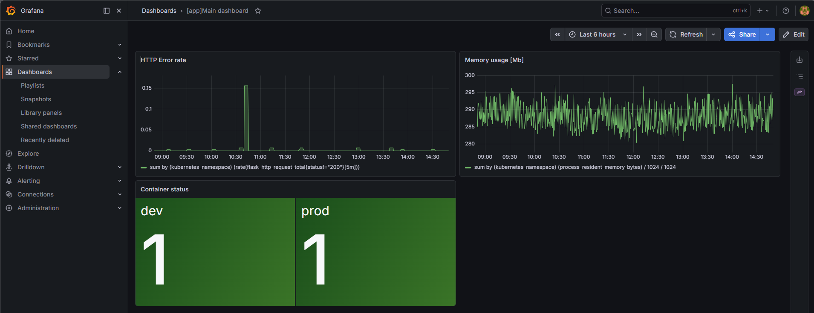
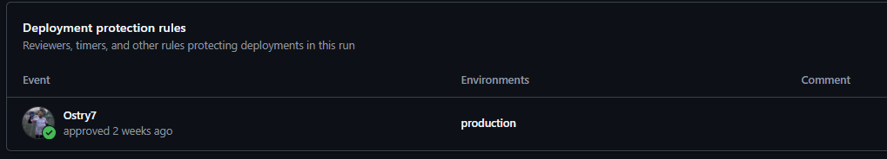
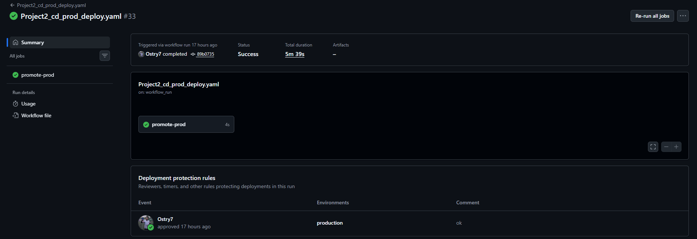

### Project — GitOps-Based Kubernetes Platform on Azure

Production-style multi-region disaster recovery platform — containerized application deployed on AKS via GitOps, with failover, WAL-based PostgreSQL replication, and full observability.

Architecture
```
GitHub Repository
        │
        ├──► GitHub Actions (CI — build & push image to ACR)
        │
        ▼
Argo CD (GitOps (ArgoCD) — watches repo, syncs cluster state)
        │
        ▼
AKS Primary (West Europe)                    AKS DR (Poland Central)
        │                                            │
        ├── Helm (dev / prod namespaces)             ├── CNPG DR Cluster (replica)
        ├── CNPG Primary Cluster                     └── WAL recovery from Azure Blob
        ├── WAL archive → Azure Blob (GRS)
        ├── Internal LoadBalancer (5432)
        ├── Prometheus
        └── Grafana
```

### Tech Stack:

|       Layer       |                          Tools                         |
|:-----------------:|:------------------------------------------------------:|
| Infrastructure    | Terraform, Azure (AKS, ACR, VNet, Storage Account GRS) |
| Container runtime |            Docker, Azure Container Registry            |
| Orchestration     |                 Kubernetes (AKS), Helm                 |
| GitOps            |                         Argo CD                        |
| Database          |            CloudNativePG (CNPG), PostgreSQL            |
| CI/CD             |                     GitHub Actions                     |
| Observability     |                   Prometheus, Grafana                  |
| Application       |                     Python / Flask                     |


VNet Peering connects both clusters — the DR replica streams WAL from the primary over a private internal IP.

### Prerequisites:

First things first we need to generate the `AZURE_CLIENT_ID`, `AZURE_CLIENT_SECRET`, `AZURE_CREDENTIALS` secrets and put it into Github Secrets and variables.

```
az ad sp create-for-rbac \
  --name "github-actions-sp" \
  --role="Contributor" \
  --scopes="/subscriptions/TWOJ_SUBSCRIPTION_ID" \
  --sdk-auth
```

## Pipelines

### `Project2_ci_infrastructure` Bootstrap the infrastructure:

This pipeline creates whole environment based on `terraform/` directory. Worflow sequence:
- `terraform-lint` -> checks terraform syntax,
- `terraform init`, `terraform plan`, `terraform apply` -> creates all resources (as terraform is declarative instead of imperative it creates only missing resources),
- `install ArgoCD` -> using `kubectl` it installs ArgoCD,
- `kubectl  create namespace dev`, `kubectl create namespace prod` -> creating `dev` and `prod` namespaces in Kubernetes.
- deploy `argocd-app-dev.yaml` and `argocd-app-prod.yaml` application using `kubectl apply -f "GitOps-Based Kubernetes Platform on Azure/gitops/argocd-app-dev.yaml"`

Based on different Helm values files proper environment will use correct values i.e. for `dev`:
```yaml
[...] #argocd-app-dev.yaml
    helm:
      valueFiles:
        - environment/dev/values.yaml
  destination:
    server: https://kubernetes.default.svc
    namespace: dev
[...]
```
- bootstrap monitoring objects -> using already created Kubernetes manifests the pipeline will create monitoring staff (also with previously created Grafana dashboard)
```yaml
[...]
      - name: Install Prometheus
        run: |
          kubectl create namespace monitoring
          kubectl apply -f "GitOps-Based Kubernetes Platform on Azure/gitops/monitoring/Prometheus/"
  
      - name: Install Grafana
        run: |
          kubectl apply -f "GitOps-Based Kubernetes Platform on Azure/gitops/monitoring/Grafana/"
```
Working Grafana dashboard:



### `Project2_ci_build` Build & Deploy

Triggered on every push. Builds the Docker image, pushes to ACR, and updates the Helm values image tag for dev. Argo CD detects the diff and syncs the cluster.

```
build image → push to ACR → update dev image tag → commit
                                    │
                             ArgoCD detects diff
                                    │
                             sync dev namespace
                                    │
                    trigger Project2_cd_prod_deploy
                                    │
                          manual approval gate
                                    │
                          update prod image tag
                                    │
                             ArgoCD syncs prod
```
Prod deploy requires manual approval — configured as a GitHub Environment protection rule on the main branch.


### `Project2_DR_failover` - Perform Failover

Triggered manually via `workflow_dispatch`. Requires typing `FAILOVER` in the confirmation input — guards against accidental execution.

```
[manual trigger: "FAILOVER"]
        │
        ▼
promote cnpg-cluster-dr → replica.enabled: false
        │
        ▼
wait: cluster phase = "Cluster in healthy state"
        │
        ▼
verify: pg_is_in_recovery() = false   ← DR is now writable primary
        │
        ▼
patch db-config ConfigMap (prod + dev)
  db_mode: "PRIMARY" → "DR"
        │
        ▼
rollout restart devops-app (prod + dev)
  ← pods pick up new DB_MODE, UI header shows "DR"
```

Failover operates only on the DR cluster — the primary AKS is intentionally left untouched (assumed unavailable or degraded).

### `Project2_DR_failback` Failback to primary

Triggered manually via `workflow_dispatch`. Requires typing `FAILBACK`. Full restoration sequence — brings the primary back and resets the DR cluster to replica mode.

```
[manual trigger: "FAILBACK"]
        │
        ▼
on-demand backup of cnpg-cluster-dr (DR → Azure Blob)
  wait: backup phase = completed
        │
        ▼
delete cnpg-cluster-primary + PVC (prod namespace, primary AKS)
        │
        ▼
clean WAL archive: delete blobs matching cnpg-cluster-primary/*
  (prevents timeline conflict on restore)
        │
        ▼
apply cnpg-failback.yaml (recovery from DR backup)
  WAL_PATH injected via sed from terraform output
        │
        ▼
patch cnpg-cluster-primary: remove /spec/replica
  → promote to standalone primary
  wait: cluster phase = "Cluster in healthy state"
        │
        ▼
patch cnpg-cluster-dr: replica.enabled: true
  → DR goes back to streaming replica mode
        │
        ▼
patch db-config ConfigMap (prod + dev)
  db_mode: "DR" → "PRIMARY"
        │
        ▼
rollout restart devops-app (prod + dev)
        │
        ▼
verify: pg_is_in_recovery() = false on primary
```

The failback manifest (`database/prod/failback/cnpg-failback.yaml`) lives outside the standard ArgoCD sync path — it's applied directly by the pipeline to avoid Argo CD reconciling it away mid-restore.

### TIPS:
If you're creating new environment after `terraform destroy` we need to refresh the kubeconfig:

1. Connect local `kubectl` to Azure AKS cluster (primary - prod site):
```bash
az aks get-credentials \
--resource-group gitops_rg2345234 \
--name example-aks1_test234 \
--overwrite-existing
```

2. Connect AKS to ACR:
```bash
az aks update \
  --resource-group gitops_rg2345234 \
  --name example-aks1_test234 \
  --attach-acr gitopscontainerregistry7677
```

3. Connect `kubectl` to Azure AKS cluster (DR site):
```bash
az aks get-credentials \
  --resource-group gitops_rg2345234_dr \
  --name aks-dr-234623465 \
  --context aks-dr \
  --overwrite-existing
```

4. Swtich between k8s contexts:
```bash
# context list:
kubectl config get-contexts

# switch contexts:
kubectl config use-context <context_name>

# primary context:
kubectl config use-context example-aks1_test234

# dr context:
kubectl config use-context aks-dr


### Project2_ci_build:

This pipeline is building and pushing Docker image to ACR and updating image tag Helm values (based on env: `dev` and `prod`). Only `ArgoCD` is watching any changes on the repo and commiting the changes if needed.

To enter the ArgoCD console we need to add LoadBalancer using:

```yaml
kubectl patch svc argocd-server -n argocd -p '{"spec": {"type": "LoadBalancer"}}'

#ArgoCD console admin password:
kubectl -n argocd get secret argocd-initial-admin-secret -o jsonpath="{.data.password}" | base64 -d
```

To check what image is used for `dev` and `prod` deployments:

```bash
echo "DEV:"
kubectl describe pod -n dev | grep "Image:"
echo "PROD:"
kubectl describe pod -n prod | grep "Image:"
```

If a change is applied to the `dev` environment, the `Project2_cd_prod_deploy.yaml` workflow is triggered. In GitHub, we have configured an environment (based on the main branch) where the pipeline pauses and waits for manual approval before proceeding with the production deployment. Once the change is approved, the image tag from the `dev` environment is also updated in the prod Helm values file. ArgoCD then detects the difference between the desired and actual state, updates the Kubernetes manifests with the new tag, and Kubernetes pulls the corresponding image.



### Prepare fake data (fake inserts)

Ino `psql-configmap.yaml` we've got some fake generated inserts:
```yaml
[...]
 fake_insert.sql: |
    INSERT INTO products (name, price, category)
    SELECT
      t.name || ' ' || i,
      round((t.base_price + random() * t.variance)::numeric, 2),
      t.category
    FROM generate_series(1, 500) i
[...]
```
It'll be mounted into `psql-db-0` pod under `/sql` directory. To insert some fake data do the following:
```yaml
# connect into pod:
kubectl exec -it psql-db-0 -n prod -- /bin/bash 

# run psql statement:
sql -U looser -d devspace -f /sql/fake_insert.sql
 ```